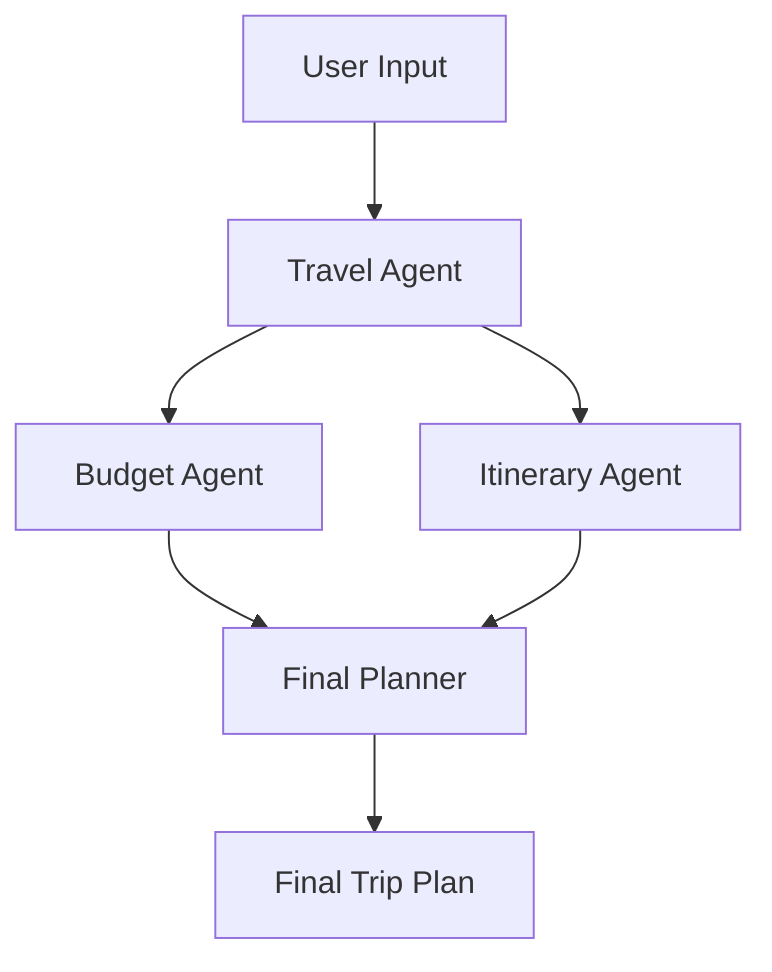

# Vacation Trip Planner using CrewAI

This project demonstrates how to use CrewAI to create an automated vacation trip planning system. The system uses multiple AI agents working together to plan the perfect vacation based on user preferences.

## Flow Diagram


## Features
- Travel preferences analysis
- Budget planning
- Itinerary creation
- Final trip plan generation

## Setup

### 1. Set up Virtual Environment

#### Windows
```bash
# Run the setup script
setup_venv.bat

# Or manually:
python -m venv .venv
.venv\Scripts\activate
pip install -r requirements.txt
```

#### Unix/Linux/MacOS
```bash
# Run the setup script
chmod +x setup_venv.sh
./setup_venv.sh

# Or manually:
python3 -m venv .venv
source .venv/bin/activate
pip install -r requirements.txt
```

### 2. Set up Environment Variables
1. Copy the example environment file:
```bash
cp .env.example .env
```

2. Edit the `.env` file and configure your settings:
```env
# Required
OPENAI_API_KEY=your-api-key-here

# Optional
OPENAI_MODEL=gpt-4
TEMPERATURE=0.7
MAX_TOKENS=2000
TIMEOUT=60
```

Required Environment Variables:
- `OPENAI_API_KEY`: Your OpenAI API key (get it from [OpenAI Platform](https://platform.openai.com/api-keys))

Optional Environment Variables:
- `OPENAI_MODEL`: The model to use (default: gpt-4)
- `TEMPERATURE`: Controls response creativity (0.0 to 1.0, default: 0.7)
- `MAX_TOKENS`: Maximum tokens for responses (default: 2000)
- `TIMEOUT`: API call timeout in seconds (default: 60)

### 3. Run the main script:
```bash
# Make sure your virtual environment is activated
python vacation_planner.py
```

## Project Structure
- `vacation_planner.py`: Main script that orchestrates the agents
- `agents.py`: Contains the AI agent definitions
- `tasks.py`: Contains the task definitions for each agent
- `.env`: Environment variables file (create from .env.example)
- `.env.example`: Template for environment variables
- `requirements.txt`: Project dependencies
- `.venv/`: Virtual environment directory (created during setup)
- `setup_venv.bat`: Windows setup script
- `setup_venv.sh`: Unix/Linux/MacOS setup script

## How it Works
1. The Travel Agent analyzes user preferences
2. The Budget Agent calculates costs and creates a budget
3. The Itinerary Agent creates a detailed schedule
4. The Final Planner combines all information into a comprehensive trip plan

## Virtual Environment
This project uses a Python virtual environment to manage dependencies. The virtual environment:
- Isolates project dependencies from your system Python installation
- Ensures consistent package versions across different machines
- Makes it easier to manage project-specific dependencies

To activate the virtual environment:
- Windows: `.venv\Scripts\activate`
- Unix/Linux/MacOS: `source .venv/bin/activate`

To deactivate the virtual environment when you're done:
```bash
deactivate
```

## Error Handling
The script includes error handling for:
- Missing environment variables
- API connection issues
- Invalid configuration values

If you encounter any errors:
1. Check that your `.env` file is properly configured
2. Verify your OpenAI API key is valid
3. Ensure all required packages are installed
4. Check the console output for specific error messages
